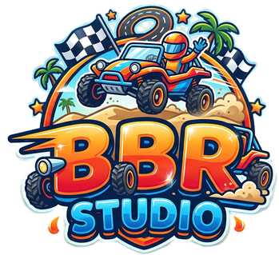
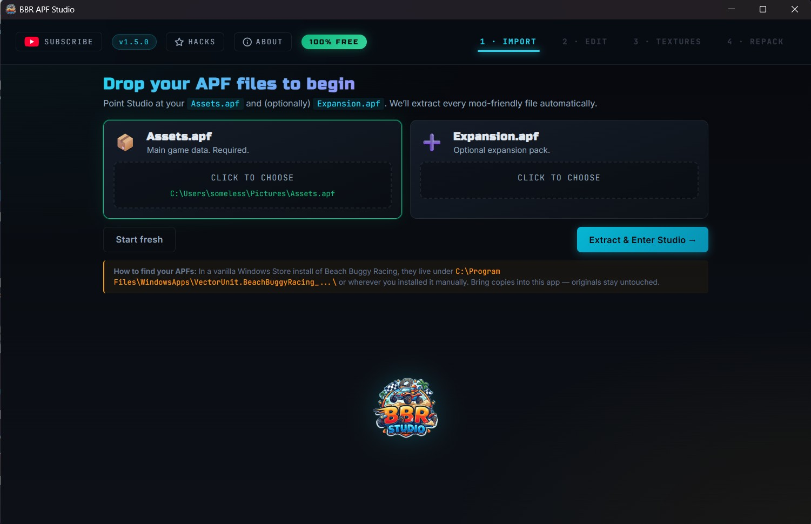
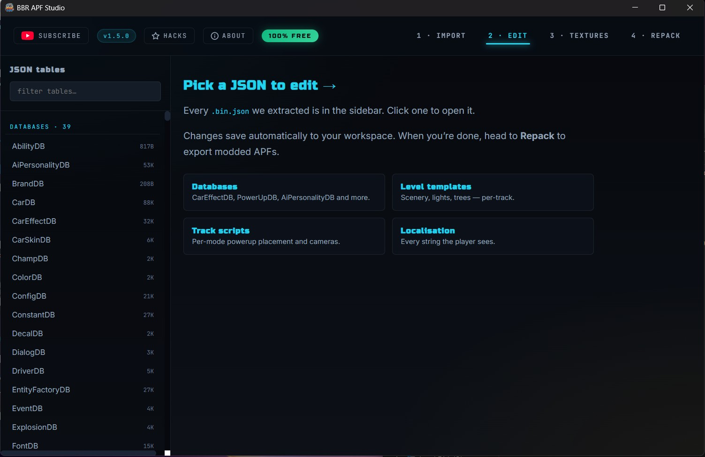
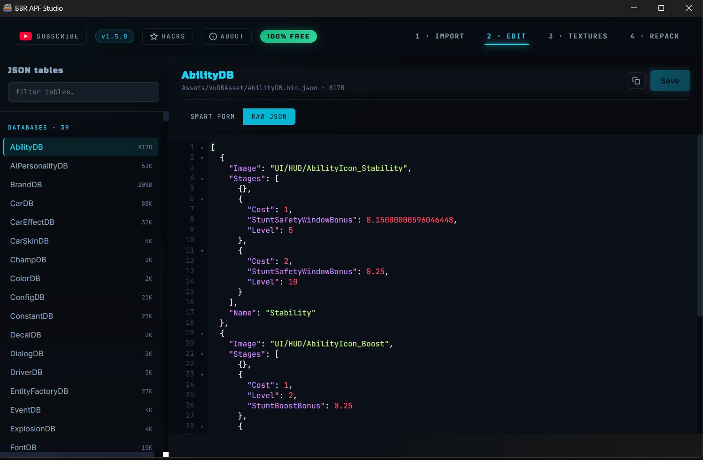
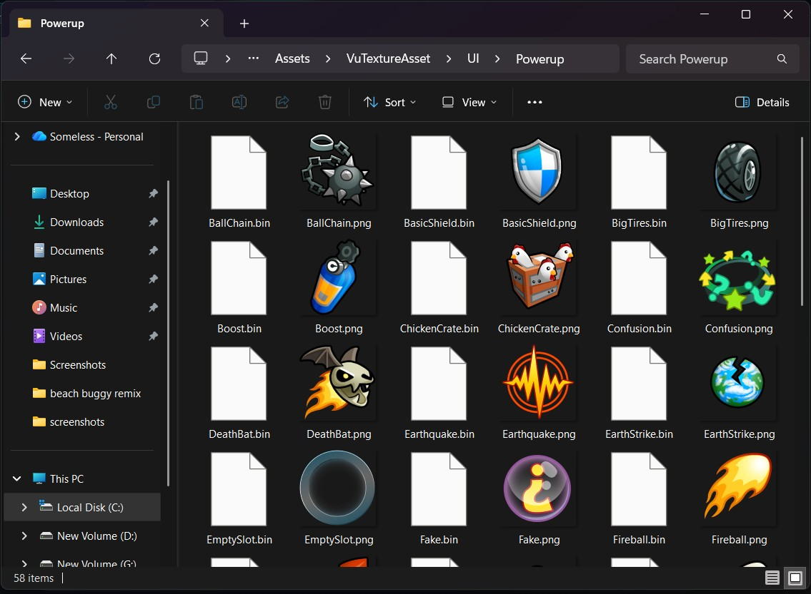
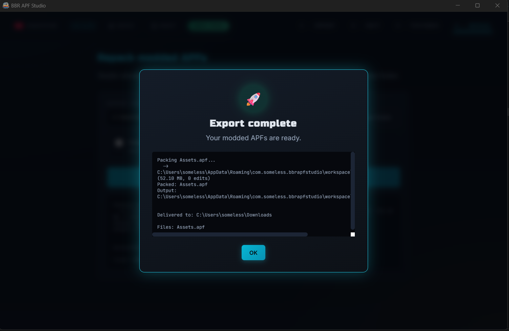

# BBR APF Studio

### The #1 mod workbench for Beach Buggy Racing

**Edit `.apf` files &middot; change powerups &middot; retexture cars &middot; repack &middot; 100% free**

[**⬇ Download Latest Release**](https://github.com/someless/bbr-apf-studio/releases/latest)
&middot;
[Features](#features)
&middot;
[Screenshots](#screenshots)
&middot;
[How to use](#how-to-use)
&middot;
[YouTube tutorials](https://youtube.com/@someless)
&middot;
[Donate](https://nowpayments.io/donation/someless)

---

## What is this?

**BBR APF Studio** is the world's first beginner-friendly modding tool for **Beach Buggy Racing** and **Beach Buggy Racing 2**. It opens Vector Unit `.apf` archive files, extracts editable databases, textures, and audio, lets you edit them with a friendly GUI, and repacks the result so you can drop the modded files straight into your game install.

No coding, no command line, no Python setup. Just click, edit, export.

If you've ever wanted to:

- Give your car **999 boost charges** per pickup
- Make a **rocket-speed turbo** that flings your buggy to the moon
- Replace the **title-screen logo** with your own art
- Rain **powerup crates from the sky** across entire tracks
- Scale every **tree on a track to 4×** for a giant jungle effect
- Remove the **invisible sky ceiling** so cars fly forever
- Edit AI behaviour to create **elite opponents**
- Repaint **car textures, driver skins, HUD icons, menu buttons**

…you're in the right place.

## Features

### ✨ Visual editing — no JSON needed
- **Smart Form mode** — every value in every game database renders as a labelled input with plain-English hint tooltips.
- **Raw JSON mode** — full CodeMirror editor with syntax highlighting, line numbers, bracket matching, code folding, and **live multi-error lint underlines** for instant syntax feedback.
- **Pulsing error bubble** jumps you to the first syntax error in one click.

### 🎨 Texture hot-swap
- Opens your APF's texture folder in Windows Explorer.
- Paint / resize / replace PNGs with any image editor (Paint, GIMP, Photoshop, Krita).
- Supports BBR1 PC, BBR1 Android, BBR2 desktop, and BBR2 Android texture formats, including ETC/ETC2 mobile textures.
- Delete-and-paste workflow works perfectly — the repacker auto-detects edits via modification time.

### 🎁 Mod Config export (new in 1.7)
- New **Mod Config** tab packages just the files you changed into a tiny `.bbc` file other players can import — instead of sharing a 100+ MB modded APF.
- **Selective export** — browse every changed file grouped by category (Databases, Textures, Music, SFX, Level Templates, Track Scripts, Localisation), tick only the ones that belong to *this* mod, leave the rest of your workspace edits out.
- **Rich metadata** — mod name, author, version, description, target APF (auto-detected), optional thumbnail PNG.
- **No baseline? No guessing.** If the workspace lacks a baseline (e.g. `.bbrws` loaded without one), Studio shows a clear amber warning with a "Go to Import" button instead of dumping every file as "changed".
- Works hand-in-hand with **BBR Manager V3** — players import `.bbc` mods, toggle them on/off, and the Manager rebuilds the APFs from a pristine baseline every time. Installing and removing mods is always clean.

### 🎧 Sound modding (new in 1.6)
- Browse every music track and SFX sample extracted straight from the game's FMOD banks.
- **In-app preview player** with play/pause, scrubber, buffered-range indicator, volume, and per-row loading spinner.
- Drop any WAV in to replace a sound — Studio matches the original name, re-encodes as PCM16, and patches every FSB5 size field so the game actually plays the new audio.
- Cross-session workspace — close the app mid-edit, reopen, continue exactly where you left off.

### 🧬 Level scene editing
- Move, delete, duplicate, or **scale** any entity on any track.
- Pre-built recipes for **giant trees**, **sky-rain powerups**, **no-powerup purist mode**.
- Works on every stock track: Blizzard Vale, Sandy Shores, Skull Creek, Pyramid Quarry, Lost Tunnels, Volcano Island, and more.

### 🚀 Real-time progress pipe
- Python toolkit streams progress via Tauri IPC channels — you see **0 → 100%** live during extract and repack.
- Hacker-style decode log for visual flair.

### 📦 Self-contained — zero dependencies
- Ships with an embedded Python 3.12 runtime + Pillow + numpy + texture2ddecoder + etcpak.
- Works on fresh Windows installs without installing anything else.
- **~23 MB installer**, ~80 MB installed footprint.

### 🧩 Multi-APF import (new in 1.9)
- Import `Assets.apf`, optional `Expansion.apf`, and optional `HF.apf`.
- Repack loops over every imported APF, so extra BBR archives are preserved in the workflow instead of being ignored.
- BBR2 JSON tables decode to editable `.bin.json` and pack back into APF when changed.

### ⭐ Built-in tutorial
- Curated **"Quick Hacks for BBR1"** — 8 hand-picked beginner mods, each with the exact file path and the exact value to change.
- Links straight to my YouTube channel for video walkthroughs.

## Screenshots

<em>Step 1 — Import Assets.apf, optional Expansion.apf, and optional HF.apf</em>

<em>Step 2 — Smart form editing with hint tooltips for every field</em>

<em>Raw JSON editor with live syntax highlighting and multi-error lint</em>

<em>Step 3 — Browse and replace 620+ game textures</em>

<em>Step 4 — Repack with live progress → drop into your game folder → launch</em>

## Download

Grab the latest installer from the [**GitHub Releases**](https://github.com/someless/bbr-apf-studio/releases/latest) page.

**Installer size:** ~23 MB (NSIS-compressed)
**Installed size:** ~80 MB (includes embedded Python + dependencies)
**Platform:** Windows 10 / 11 (x64)

## How to use

### Step 1 — Install
Run `BBR APF Studio_1.9.0_x64-setup.exe`. Standard Windows installer — Start-menu shortcut + desktop icon.

### Step 2 — Launch & import
Open **BBR APF Studio**. On the **Import** tab, pick your game's `Assets.apf`, optional `Expansion.apf`, and optional `HF.apf`. The files live in your Beach Buggy install folder, APK asset folder, or wherever you extracted the game archives.

Click **Extract & Enter Studio →**. Progress bar fills live as Python unpacks the archives.

### Step 3 — Edit
- **Edit tab** — every JSON database, level, track script, and localisation file appears in the sidebar. Click one to open it. Use **Smart Form** for guided editing or **Raw JSON** for direct syntax.
- **Textures tab** — click **Open Textures Folder** → Windows Explorer opens → edit PNGs with your image editor → save.

### Step 4 — Repack
Go to the **Repack** tab. Pick an output folder. Click **🚀 Repack & Export**. Studio rebuilds your modded `.apf` files with every edit applied.

### Step 5 — Install into game
Copy the files from your chosen output folder into your Beach Buggy install folder, overwriting the matching APFs. **Always back up the originals first.** Launch the game.

## Quick Hack Showcase

Some of the mods you can pull off in under 60 seconds each:

| Hack | File | Change |
|---|---|---|
| Name on title screen | `VuStringAsset/en` | `Title_Start` → your text |
| 99-charge boost pickup | `VuDBAsset/PowerUpDB` | `Boost.Variations[*].Charges = 99` |
| Rocket-speed boost | `VuDBAsset/CarEffectDB` | `Boost.Power=10, Speed=200, Duration=10` |
| No sky ceiling | `VuDBAsset/ConstantDB` | `Hollywood*.Z = 99999` |
| Giant trees | `VuTemplateAsset/Levels/IceA` | `Scale = {X:4, Y:4, Z:4}` on every plant |
| Sky-rain powerups | `VuProjectAsset/IceA_Race` | Duplicate `Gameplay_Powerups`, set Z=80 |
| Remove all powerups | `VuProjectAsset/<Track>_Race` | Delete all `Gameplay_Powerups` entries |

For full step-by-step guides, **open the app → click Hacks** in the top bar, or **watch the video tutorials on my YouTube channel**.

## Compatibility

| Game | Status |
|---|---|
| **Beach Buggy Racing (BBR1) — Windows / Microsoft Store / Android** | ✅ Supported |
| **Beach Buggy Racing 2 (BBR2) — desktop / Android** | ✅ Supported for APF extract/repack, JSON, PNG, music, and SFX workflows |
| Other Vector Unit games (Riptide GP, Hydro Thunder) | ⚠️ Not tested |

## What can't be edited?

Honest limits:

- 🚫 **3D models** (car bodies, track geometry, character meshes) — custom binary format, not decoded.
- 🚫 **Animations** — custom bone/transform binary.
- 🚫 **Collision meshes** — custom physics binary.
- 🚫 **Audio banks** (`.bank`) — FMOD Studio proprietary, needs original project.
- 🚫 **Compiled shaders** — HLSL bytecode, GPU-specific.

You can still move, delete, duplicate, or scale **references** to these assets inside the level JSON files — you just can't reshape the model itself.

## About the creator

I'm **someless**. I spent many days and nights reverse-engineering Beach Buggy Racing's proprietary APF + VUJB formats — the dual integrity hashes, the quirky body-offset layout, the obscure VUJB type codes, the Windows Store platform marker — so that modders around the world don't have to touch a single line of code.

Every feature in Studio is hand-crafted: the real-time progress pipe, the multi-error JSON linter, the bundled Python runtime, the hacker-style loading overlay, the smart-form hints, the level-scene editor.

**BBR APF Studio is 100% free, forever.**

If it saved you time or made you smile, consider supporting the project:

### ⭐ Support the project

| | |
|---|---|
| 💛 **Donate** (crypto or card) | https://nowpayments.io/donation/someless |
| 🎬 **Subscribe on YouTube** for video tutorials & more mods | https://youtube.com/@someless |
| 💬 **Business inquiries via WhatsApp** | +255 620 428 389 |

## FAQ

**Q: Is this legal?**
A: You own your game copy. Modding single-player game files for personal use is within your rights. Don't redistribute modified game files — distribute only your mod changes (patches, recipes).

**Q: Will it work on Steam BBR1?**
A: The Microsoft Store version is tested. Steam release uses the same engine and should work — untested, report back if you try it.

**Q: Can I use this to make a paid mod pack?**
A: This tool is free — the mods you make with it are your property. You can't resell the tool itself (see [LICENSE](LICENSE)).

**Q: Will my antivirus flag the installer?**
A: Small unsigned Windows apps often trigger heuristic warnings. The source code is available on request; the binary is built from this repo's release workflow.

**Q: Can I contribute?**
A: Not to the source (closed-core to keep the tool unified). But you can: report bugs, request features via GitHub Issues, or publish your own mod packs showcasing what Studio can do.

## License

**Free to download, install, and use for personal and non-commercial modding.**
**Not** free to redistribute, modify, reverse-engineer, or resell.
See [LICENSE](LICENSE) for the full terms.

## Not affiliated

This is an **unofficial** community tool. Beach Buggy Racing is © Vector Unit. This project is not affiliated with, endorsed by, or sponsored by Vector Unit.

---

### Happy modding

Built with ❤️ by **[someless](https://youtube.com/@someless)** &middot; **v1.9.0** &middot; **2026**

If BBR Studio helped you, a ⭐ on this repo goes a long way.

